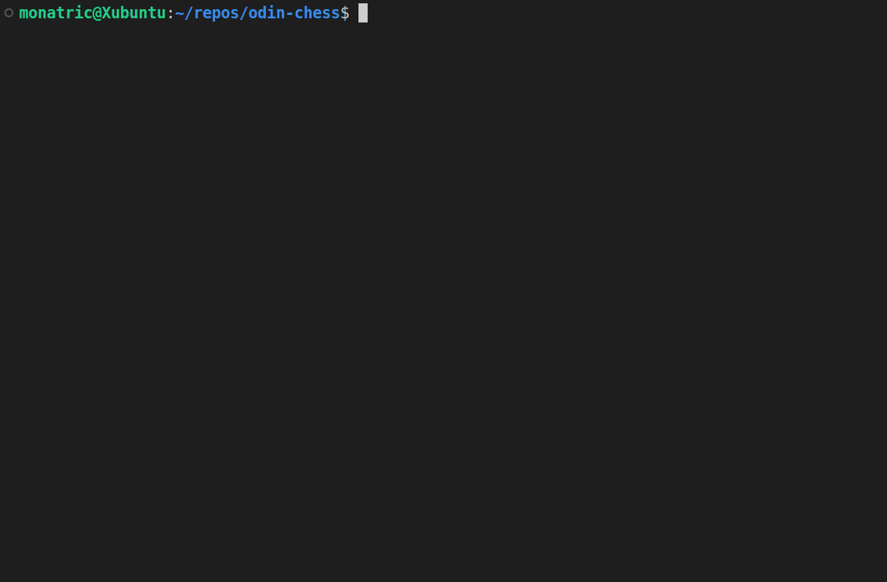

# Ruby Final Project: Chess

This is the final project in the [Ruby course of The Odin Project](https://www.theodinproject.com/lessons/ruby-ruby-final-project) from the RoR path.

Chess is a classical board game that is played since the ancient times. This is composed of a 8x8 dimension board, with 16 pieces each from both players.

## Game demo

*Fried Liver Attack opening with a King move blunder*

## How to play

To play online, you can [play at replit](https://replit.com/@Monatric/chess)

To play locally, follow these steps:
1. Clone the repo on your machine, `cd` into the project, and install dependencies using bundler with `bundle install`.
1. Enter `ruby main.rb` to run the game. This project is built with Ruby 3.2 version.

To run the tests:
1. RSpec is used for testing with version 3.13.
1. It starts with `rspec`. This runs all the tests.
1. Check out all the other files under the `spec/` directory to test those specific files, e.g. `rspec spec/chess/game_spec.rb`.

## Features

- The game can be played by two players via command line
- To make a move, the player must enter the origin and destination coordinates e.g. "e2e4"
- Save and load your game
- Methods are well tested with RSpec
- The game follows the standard chess rules

## Playing instructions

### Movement

The game follows the Smith notation for moving the pieces. Smith notation is a straightforward chess notation designed to be reversible and represent any move without ambiguity. The notation encodes the source square and destination square. However, I didn't include the part where the notation includes the piece captured.

For example, enter the coordinate of the piece you want to move, such as "e2", and enter the coordinate where you want the piece to move, such as "e4". Thus, the movements look as follows:

- e2e4
- b8c6
- c1h6

For castling, simply enter the destination of the king where it should be castled. It is like moving two squares to that destination. Example:

To castle short as white:

- e1g1

To castle long as black:

- e8c8

To promote a pawn:

- f7f8
- This will prompt the user to select between 1-4, indicating each piece corresponding to the number.

For captures and and checks, they are all the same. No additional symbols; just the source and destination coordinates.

### Game options

When the program runs, you have two options to choose from.

1. New Game - This creates a new game.
2. Load Game - This loads your last saved game.

After that, there are three options you may want to use.

1. "i" - Provides the instructions for moving a piece
2. "save" - Saves the game
3. "exit" - Exits the game

## Learning Outcome

- OOP fundamentals. Encapsulation was my first issue; I allowed other classes to manipulate other classes' data. Apparently we shouldn't even let the classes know much about other classes in the first place.
- Abstraction. I may have completed the project but I am quite unsatisfied with my abstraction here. The worst issue here of them all is manipulating the board positions, and I should not have relied on a simple hash data for managing this.
- In addition to above, I could've made a class for translating the entered moves, such as e2e4. I didn't realize how difficult how I handled this until it became repetitive, so there would be scattered logic everywhere about handling the source and destination and all that logic
- Too much parameters for a single class, such as Game and FEN. There might be a better way to handle this.
- Found out about circular dependencies. Like, I initialized class Chessboard in Game, and initialized both of these classes in Piece. This would've made my code even more complex.
- Testing, testing, testing. Suffice to say I at least got a little used to using RSpec. I might've developed an idea on which methods should be stubbed, how doubles work, and which methods should be tested in isolation or integration. But the overall concepts are still tough to digest.
- Namespacing, modules, keyword arguments, class methods, inheritance, separation of concerns, and spying in tests are some of the concepts I learned along the way that I can think of on top of my head.
- There is an issue with slight lagging here, and the main reason is repeated looping for finding the covered squares of pieces, legal moves, and analyzing threats and game status such as checkmates and stalemates, which became computationally expensive. There's an opportunity here to refactor as well to reduce to fewer or one loop instead.
- I've also realized pretty late how comments per method as part of its documentation are very valuable. Since I worked on this project while doing my college, I've gradually forgotten the purposes of some of my methods, despite having a clear well-written name.
- Perhaps drawing an actual flowchart for different classes and interactions would've helped for visualizing the project. Although in a sense this visualization is pretty difficult since there were a lot of factors I did not anticipate which caused multiple refactoring rabbit holes.
- There's still a lot of refactoring opportunities I can dive in here. But I'll probably leave this for now.

## Future improvements to be made

### Computer Player
- Even a basic one seems easy to implement; just one that picks a random legal move.

### User Interface
- Colored board squares. This seems quite complicated to do so, although it is interesting to learn about. Background-less squares worked for me so I didn't bother with it that much.
- Improve invalid move feedback. The message only prints either "invalid move" or "king is in check.". Could make use more of specific errors, like "invalid coordinates" or "piece is pinned".

### Project Code
- Refactor game conclusion, such as checkmates and draws. It is computationally expensive to run each move as it loops the board, return a list of covered squares, duplicate the board to check for all legal moves, and all that stuff. Repeat for another check for game conclusion.
- Move the UI into its own module or in displayable instead of populating the main.rb
- Delegate the move logic ("e2e4") into its own class, such as Position. At the later stage of the development, a lot of methods had its own way of manipulating the coordinates. I didn't stick to one notation, such as the coordinate or XY position; instead I went for both, which became confusing.
- Pieces should know their locations too. It is only until later that I realized I had the piece ask the board for its position. 

### Tests
- I didn't write tests for every classes, but most of them are well tested. There were some parts that simply worked really well, never had to test through the CLI repeatedly, which seemed those didn't need testing at all. However, it would've still made writing methods and classes much smoother, as well as TDD-ing the methods.  

## Time Spent

- Took me about 8+ months to _kind of_ finish the project, while managing my final year of college. I say _kind of_ because of potential minor issues, and with a lot of refactoring I can consider.

## Special Thanks

To Roli, josh, rlmoser, X AJ X, and everyone else from the The Odin Project discord server for guiding me on this Chess project.
